# WealthUp — Complete Visual Design Review

## Product

WealthUp — Personal Wealth OS

## Review Environment

- **Public Demo URL:** https://personal-wealth-os-demo.vercel.app
- **Framework:** Vite 5 + vanilla TypeScript (no React/Vue)
- **Styling:** Vanilla CSS with CSS custom properties + Tailwind CSS (calculator page only)
- **Charts:** Chart.js + lightweight-charts
- **Backend:** Firebase Auth + Firestore
- **Deployment:** Vercel

## Viewports

| Device | Width | Height |
|--------|-------|--------|
| Desktop | 1440 | 900 |
| Mobile | 390 | 844 |

## Pages Reviewed

| # | Route | Page Name | Sidebar Group |
|---|-------|-----------|---------------|
| 1 | `dashboard` | Overview | Home |
| 2 | `advisor` | Coach | Home |
| 3 | `buckets` | Money Plan | Planning |
| 4 | `goals` | Goals | Planning |
| 5 | `rules` | Rules | Planning |
| 6 | `portfolio` | Investments | Wealth |
| 7 | `market` | Market | Wealth |
| 8 | `calculator` | Scenarios | Tools |
| 9 | `ledger` | Activity | Tools |
| 10 | `review` | Review | Tools |
| 11 | `settings` | Settings | System |

---

## A. Project Overview

WealthUp is a personal finance web application built as a single-page application (SPA). It provides financial planning tools including budget allocation (buckets), investment tracking, goal setting, financial health rules, market data, a scenario calculator, an activity ledger, and periodic reviews. The UI is organized around a persistent sidebar navigation with a timeline-style design and a main content area.

## B. Current Visual / Design System Summary

### Design Language
- **Aesthetic:** Glass-morphism with translucent card surfaces (`backdrop-filter: blur(24px)`)
- **Color Palette:** Dark-mode-first with light theme variant. Primary accent green (#22c55e), secondary cyan (#06b6d4), semantic colors for status (amber, red, emerald)
- **Typography:** Inter font from Google Fonts, 3 weights (500, 600, 800), tabular numbers enabled
- **Layout:** CSS Grid-based with sidebar (260px) + main content. Responsive collapse at 720px
- **Border Radius:** Consistent tokens — 14px standard, 22px large, 10px small
- **Spacing:** Tokenized system with --gap-xs (4px) through --gap-l (24px)
- **Transitions:** Global 0.2s ease transition on interactive elements
- **Navigation:** Timeline-style sidebar with node indicators, gradient connection lines, and glow effects

### CSS Custom Properties

| Variable | Light Value | Dark Value | Usage |
|----------|-------------|------------|-------|
| `--bg` | `#f2f6f8` | `#0b1d2e` | Page background |
| `--surface` | `rgba(255,255,255,0.72)` | `rgba(22,42,64,0.65)` | Card background |
| `--nav` | `#dce6eb` | `#10263a` | Sidebar background |
| `--ink` | `#0b2540` | `#f0f5fa` | Primary text |
| `--ink-2` | `#264261` | `#d2dde6` | Secondary text |
| `--ink-3` | `#6e8590` | `#7695aa` | Tertiary text |
| `--green` | `#22c55e` | `#22c55e` | Primary accent |
| `--cyan` | `#06b6d4` | `#06b6d4` | Secondary accent |
| `--amber` | `#f59e0b` | `#f59e0b` | Warning / attention |
| `--red` | `#ef4444` | `#ef4444` | Error / loss |
| `--line` | `rgba(11,37,64,0.08)` | `rgba(255,255,255,0.07)` | Borders |
| `--glass-border` | `rgba(255,255,255,0.42)` | `rgba(255,255,255,0.08)` | Glass edge |
| `--radius` | `14px` | `14px` | Standard radius |
| `--radius-lg` | `22px` | `22px` | Large radius |
| `--transition` | `0.2s ease` | `0.2s ease` | Global transition |

---

## C. Complete Page / Route List

See Pages Reviewed table above. All 11 pages were captured at both desktop (1440×900) and mobile (390×844) viewports, plus one mobile menu screenshot.

---

## D. Desktop Screenshot Index

| # | Screenshot | Description |
|---|------------|-------------|
| 1 | 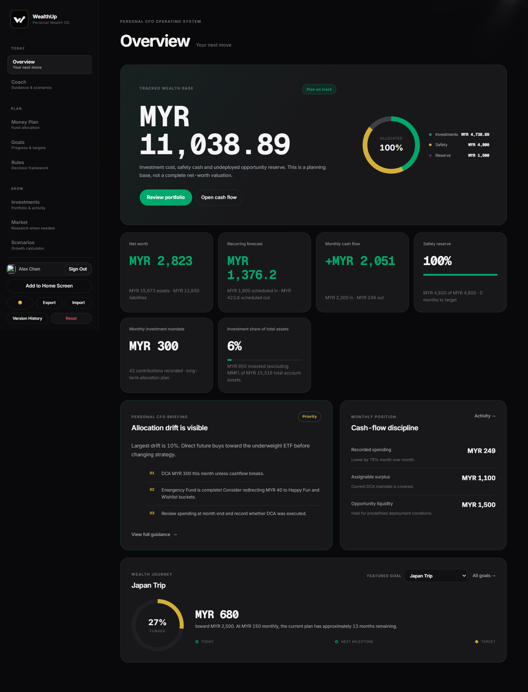 | Dashboard — hero cards with financial health score, net worth, monthly income, monthly expenses. Metric grid below with bucket, portfolio, goals, and rules summaries. |
| 2 | 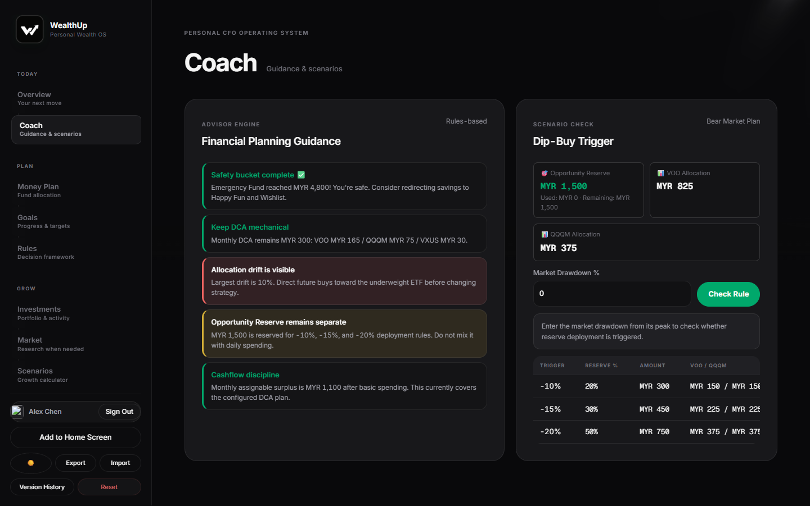 | AI Advisor — chat interface with predefined question buttons and conversation area. |
| 3 | 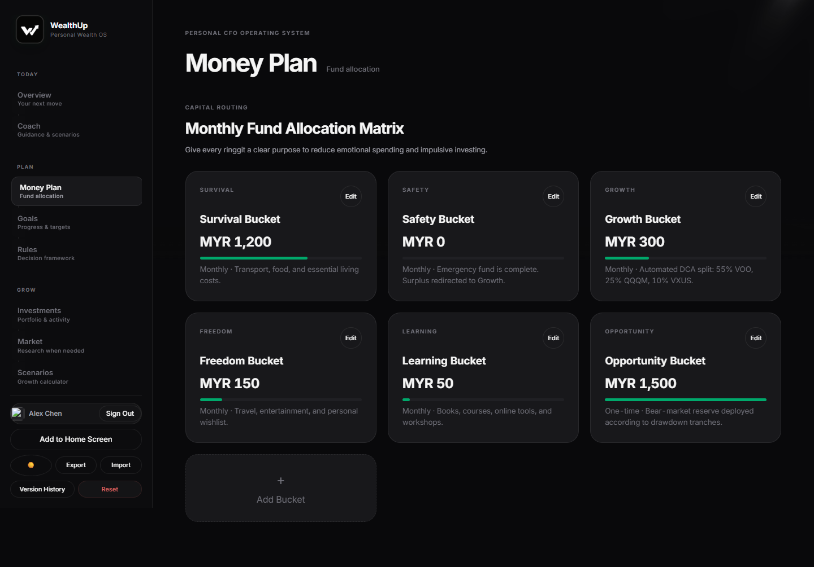 | Budget Buckets — overall/income/expense toggle with allocation cards and progress bars. |
| 4 | 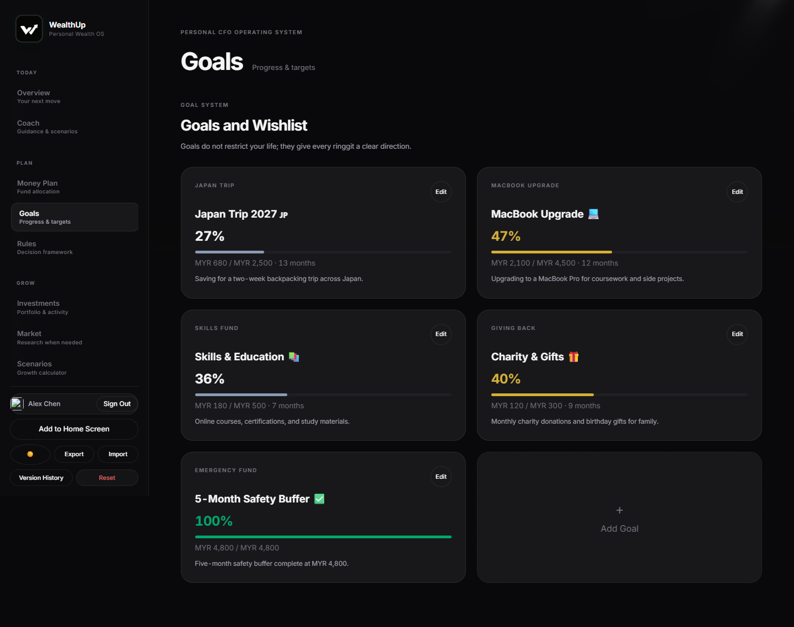 | Financial Goals — goal cards with progress bars, status badges, and target amounts. |
| 5 | 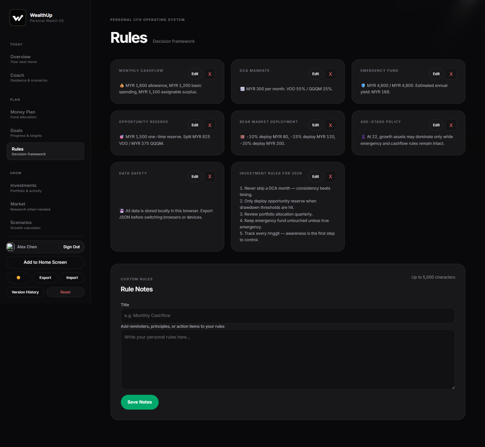 | Financial Rules — rule cards with traffic-light status indicators (green/amber/red). |
| 6 | 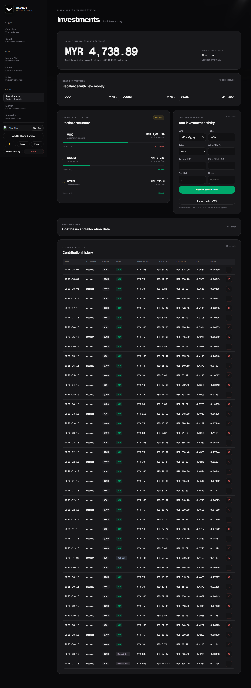 | Portfolio — ticker search, holdings table with P/L, and allocation breakdown. |
| 7 | 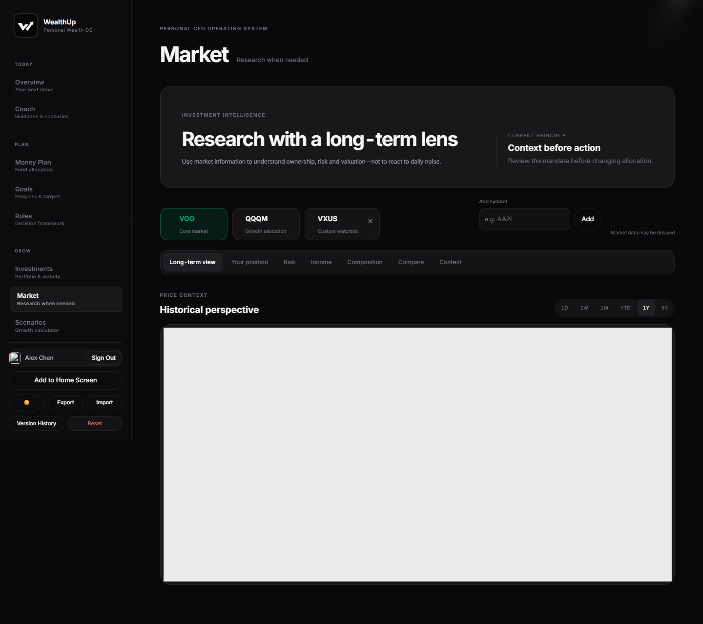 | Market Data — search bar with ticker cards showing price, change, and mini charts. |
| 8 | 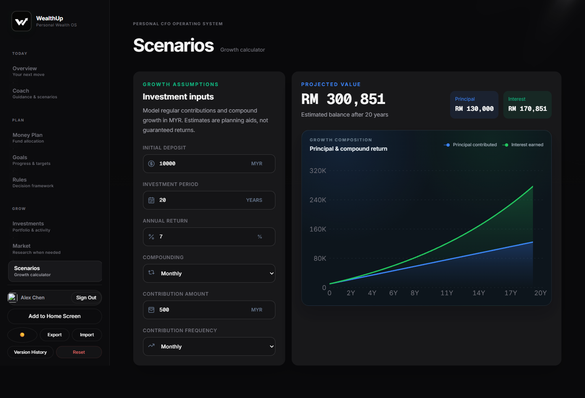 | Scenarios Calculator — tab-based calculator modes with input forms. |
| 9 | 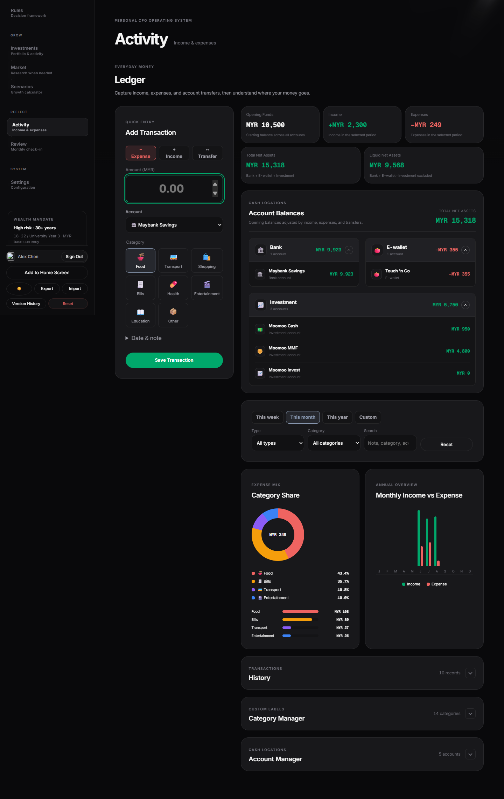 | Activity Ledger — two-column layout with entry form (left) and entry list (right). |
| 10 | 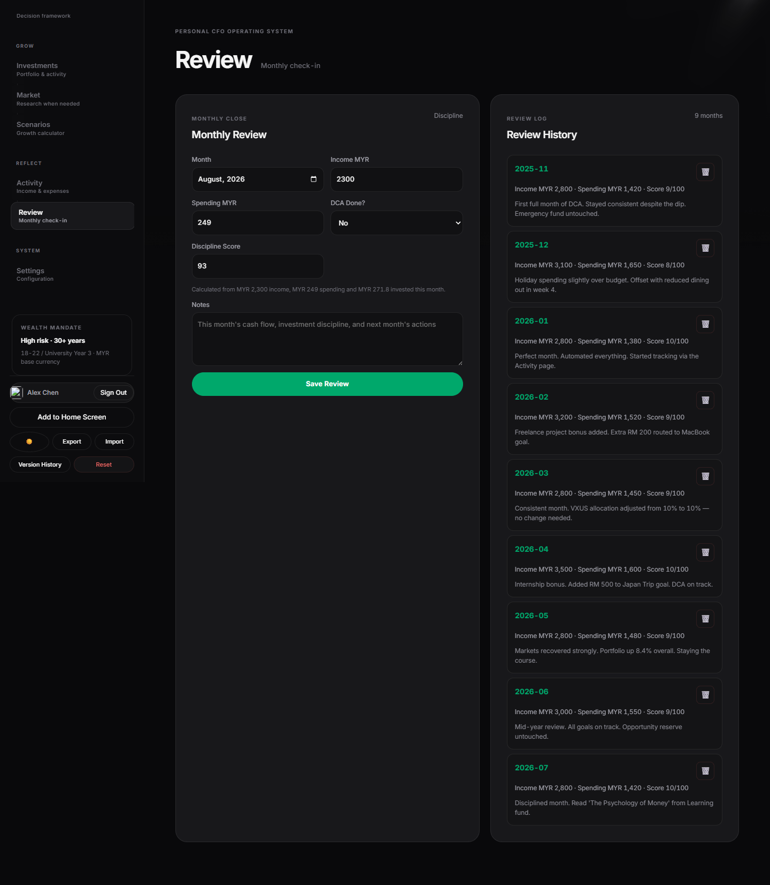 | Monthly Review — month navigation with summary statistics and breakdowns. |
| 11 | 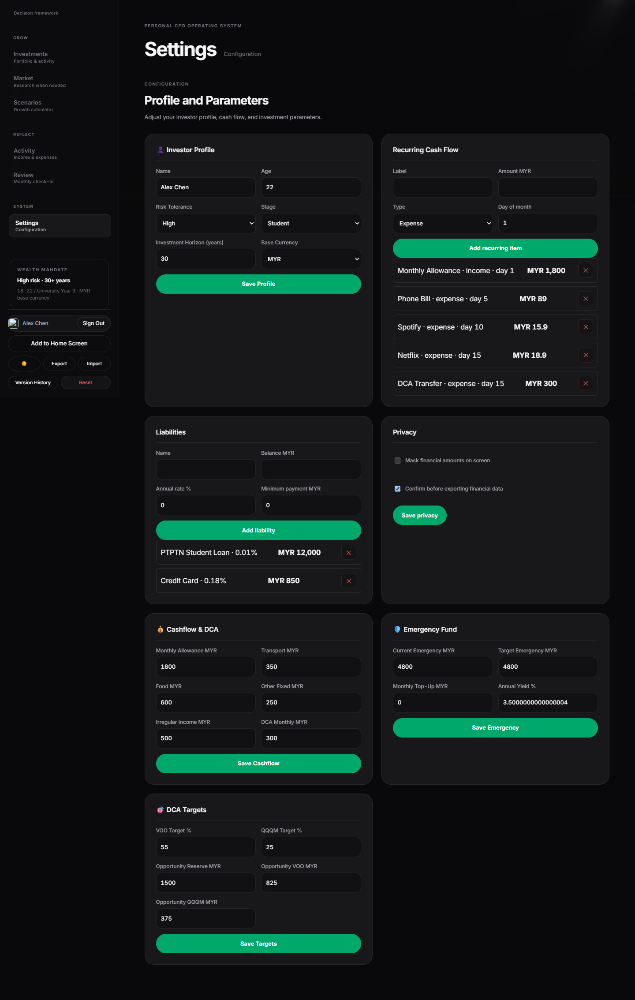 | Settings — profile form, theme toggle, data management actions. |

---

## E. Mobile Screenshot Index

| # | Screenshot | Description |
|---|------------|-------------|
| 12 | 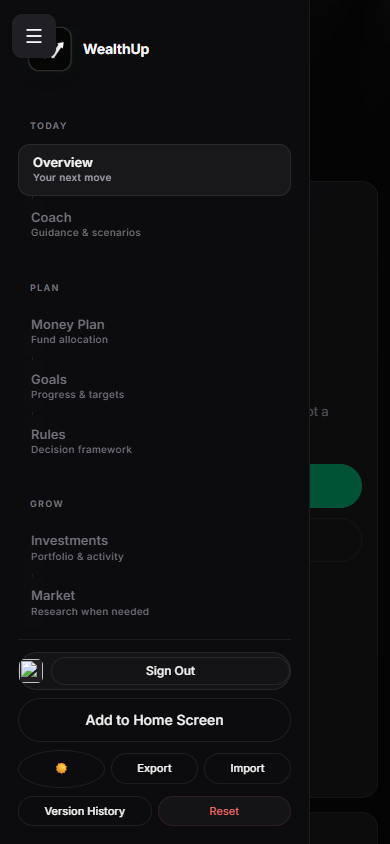 | Mobile navigation menu open state — full-screen overlay with sidebar content. |
| 13 | 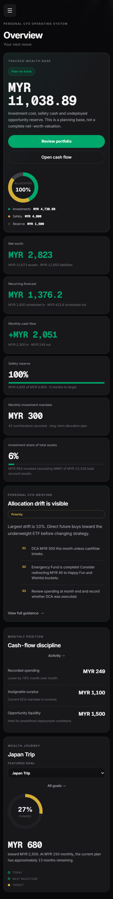 | Dashboard at 390px width — hero cards stack vertically, metric grid single column. |
| 14 | 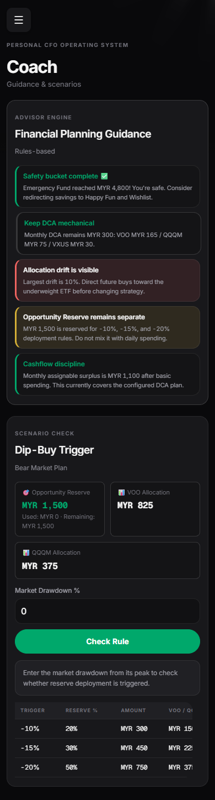 | AI Advisor at mobile viewport — chat bubbles adapt to narrow width. |
| 15 | 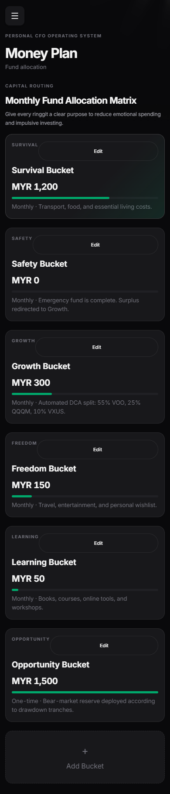 | Buckets at mobile viewport — allocation cards full-width stacked. |
| 16 | 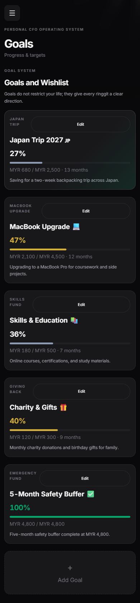 | Goals at mobile viewport — goal cards stack vertically. |
| 17 | 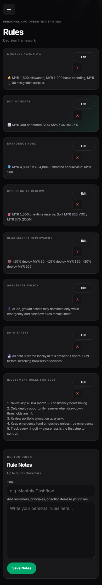 | Rules at mobile viewport — rule cards single column. |
| 18 | 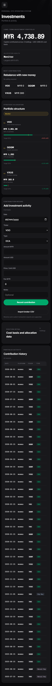 | Portfolio at mobile viewport — holdings table may require horizontal scroll. |
| 19 | 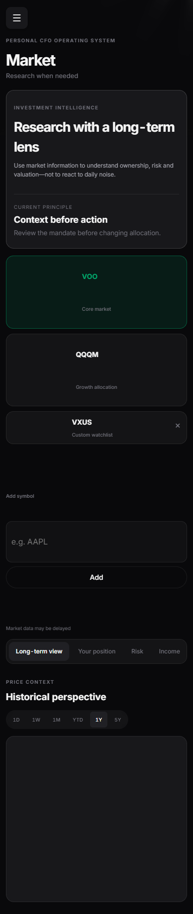 | Market at mobile viewport — ticker cards stack. |
| 20 | 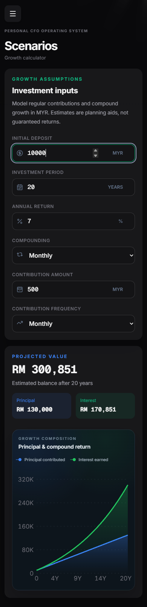 | Calculator at mobile viewport — tabs and inputs adapt to narrow width. |
| 21 | 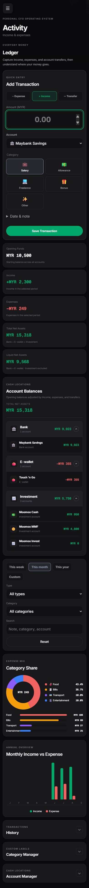 | Ledger at mobile viewport — form and entries stack vertically. |
| 22 | 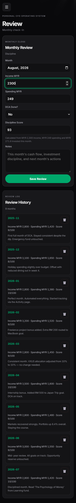 | Review at mobile viewport — summary stats reflow. |
| 23 | 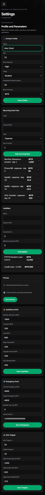 | Settings at mobile viewport — form layout adapts. |

---

## F. Existing Audit Findings

### Overall Score: 7.5 / 10

| Category | Score | Notes |
|----------|-------|-------|
| Visual Consistency | 8/10 | Strong design system with CSS custom properties |
| Responsive Design | 6/10 | Breakpoints exist but gaps at tablet sizes |
| Accessibility | 5/10 | Missing ARIA labels, focus states, contrast issues |
| Component Quality | 8/10 | Well-structured cards, badges, buttons |
| Typography | 8/10 | Inter font hierarchy is clear and consistent |
| Color System | 7/10 | Good accent palette but some hardcoded values |
| Information Density | 7/10 | Generally good but some pages are dense |
| Navigation | 8/10 | Timeline nav is distinctive; mobile hamburger works |

---

## G. Critical Issues

| # | Issue | Details |
|---|-------|---------|
| G1 | No `prefers-reduced-motion` support | Animations (card hover lifts, nav node pulse, sidebar entrance stagger) run unconditionally. Users who prefer reduced motion will experience all animations. |
| G2 | Color-only status indicators | Goals, Portfolio, and Rules pages use green/amber/red as the sole differentiator for status. No icons, text labels, or patterns for color-blind users. |
| G3 | Missing visible focus indicators | `.nav-item:focus-visible` has `background: transparent` with no visible ring or outline. Keyboard users cannot see which nav item is focused. |
| G4 | No skip-navigation link | No `<a href="#main">Skip to content</a>` element for keyboard/screen reader users. |
| G5 | No tablet breakpoint | Sidebar (260px) takes ~36% of iPad portrait viewport (768px). No intermediate collapsed/sidebar-icon state between 720px and 1080px. |

---

## H. Important Issues

| # | Issue | Details |
|---|-------|---------|
| H1 | Inconsistent card padding | Card padding varies between 16px, 18px, and 20px across different page components. Should standardize on design tokens. |
| H2 | Missing ARIA attributes | Interactive elements (`#sidebarToggle`, nav items, card buttons) lack `aria-expanded`, `aria-controls`, and `aria-label` attributes. |
| H3 | Mixed styling systems | Calculator page uses Tailwind CSS with a separate `tailwind.css` file while the rest of the app uses vanilla CSS custom properties. Creates visual inconsistency. |
| H4 | No loading/skeleton states | Charts, data tables, and async content have no placeholder or skeleton UI during loading. |
| H5 | Hardcoded hex colors | Some component styles use raw hex values (`#22405a`, `#162a40`, `#d9e3ea`) instead of CSS custom properties. Breaks theming. |

---

## I. Nice-to-Have Issues

| # | Issue | Details |
|---|-------|---------|
| I1 | No fluid typography | Font sizes are fixed across all viewports. Could use `clamp()` for responsive scaling. |
| I2 | Spacing token overlap | `--gap` (14px) and `--gap-m` (18px) are very close. Could consolidate. |
| I3 | No empty state illustrations | Pages with no data show minimal text. Could add illustrations or engaging CTAs. |
| I4 | Dark mode glass border too subtle | `--glass-border` in dark mode (`rgba(255,255,255,0.08)`) is nearly invisible. |
| I5 | No high-contrast mode | No option for users who need higher contrast than the default themes provide. |

---

## J. Responsive Findings

### Breakpoint Map

| Breakpoint | Behavior |
|------------|----------|
| 1120px | Wealth hero collapses from multi-column to single column |
| 1100px | Ledger layout collapses to single column |
| 1080px | Metric grid goes from 4 columns to 2 columns |
| 900px | Wealth metrics and ledger summary collapse to single column |
| 768px | Market ticker badges reflow |
| 720px | **Sidebar hides entirely**, mobile hamburger nav appears, app-shell becomes single column |
| 680px | Root font-size decreases, market header reflows |
| 480px | Login card max-width adjusted |
| 400px | Further padding reduction, ledger header grid |
| 390px | Main padding minimum |

### Observations

- **Desktop (1440px):** Full sidebar + main content. All grids at maximum columns. Optimal layout.
- **Tablet (768px–1024px):** Full sidebar still visible, consuming significant width. Main content area is cramped. No intermediate state.
- **Mobile (<720px):** Sidebar hidden behind hamburger. Content stacks vertically. Generally well-adapted but some data tables may overflow.
- **Hero stat cards** use `clamp(220px, 28%, 360px)` minimum — 4 cards at 28% could potentially break at narrow desktop widths.
- **Market ticker grid** uses `repeat(auto-fill, minmax(340px, 1fr))` — at widths between 340px–680px, only one column renders with potential dead space.

---

## K. Accessibility Findings

| # | Area | Finding |
|---|------|---------|
| K1 | Focus management | Nav items lack visible focus rings. Interactive cards use `role="button"` in CSS but JS must ensure it's applied. |
| K2 | Color contrast | Status badges (green/amber/red on dark backgrounds) may not meet WCAG AA 4.5:1 ratio in all cases. Health score "fair" state (amber on dark bg) is borderline. |
| K3 | Keyboard navigation | Skip-navigation link is missing. Tab order through sidebar is logical but no landmark roles to jump between sections. |
| K4 | Screen reader support | Logo images need descriptive alt text. Market badge chips should be in a `role="group"` container. Form inputs have labels but some use placeholder-only indication. |
| K5 | Motion | No `prefers-reduced-motion` media query. All CSS animations and transitions run unconditionally. |
| K6 | Mobile navigation | Hamburger button needs `aria-expanded="false"` and `aria-controls="sidebar"` attributes. Overlay should trap focus when open. |

---

## L. Component Consistency Findings

| Component | Pages Used | Consistency Notes |
|-----------|------------|-------------------|
| `.card` | All pages | Consistent glass-morphism treatment. Padding varies (16–20px). |
| `.card-title` | Most pages | Consistent 14px 650-weight styling. |
| `.card-value` | Dashboard, Goals, Review | 22px 750-weight. May be undersized for hero metrics. |
| `.eyebrow` | Multiple | 10px uppercase 600-weight. Consistent but small. |
| `.badge` / `.chip` | Rules, Goals, Portfolio, Market | Color variants are consistent but lack icons for status differentiation. |
| `.btn-primary` | Global | Consistent green gradient with glow shadow. |
| `.btn-ghost` | Global | Consistent transparent background treatment. |
| `.input-text` | Ledger, Settings, Market search | Consistent styling. Calculator inputs use Tailwind — inconsistency. |
| `.progress-fill` | Goals, Buckets | Consistent green gradient fill. Width driven by inline style. |
| Toggle buttons | Buckets (Overall/Income/Expense) | Clean toggle-group pattern. |

---

## M. Typography Findings

### Font Stack
- **Primary:** Inter (Google Fonts) with system-ui fallbacks
- **Weights loaded:** 500, 600, 800
- **Features:** `font-feature-settings: "tnum"` for tabular numbers

### Type Scale

| Element | Size | Weight | Line Height | Usage |
|---------|------|--------|-------------|-------|
| `.section-title` | 20px | 800 | 1.15 | Page headings |
| `.card-title` | 14px | 650 | 1.15 | Card headings |
| `.card-value` | 22px | 750 | 1.1 | Large metric numbers |
| `.card-sub` | 13px | 600 | 1.15 | Card subtitles |
| `.eyebrow` | 10px | 600 | 1.15 | Section labels (uppercase) |
| Body default | 14px | 500 | ~1.5 | General text |
| Small / meta | 12px | 400 | ~1.35 | Secondary information |

### Observations
- Tabular numbers are enabled globally — good for financial data alignment.
- Only 3 font weights loaded — efficient network usage.
- `.card-value` at 22px may be undersized for dashboard hero metrics (net worth, income).
- `.eyebrow` at 10px uppercase is tight; may be hard to read on lower-resolution displays.
- No fluid typography — all sizes are fixed regardless of viewport.

---

## N. Color Findings

### Palette

| Role | Light | Dark | CSS Variable |
|------|-------|------|--------------|
| Background | `#f2f6f8` | `#0b1d2e` | `--bg` |
| Surface | `rgba(255,255,255,0.72)` | `rgba(22,42,64,0.65)` | `--surface` |
| Sidebar | `#dce6eb` | `#10263a` | `--nav` |
| Primary text | `#0b2540` | `#f0f5fa` | `--ink` |
| Secondary text | `#264261` | `#d2dde6` | `--ink-2` |
| Tertiary text | `#6e8590` | `#7695aa` | `--ink-3` |
| Accent (green) | `#22c55e` | `#22c55e` | `--green` |
| Accent (cyan) | `#06b6d4` | `#06b6d4` | `--cyan` |
| Warning (amber) | `#f59e0b` | `#f59e0b` | `--amber` |
| Error (red) | `#ef4444` | `#ef4444` | `--red` |

### Observations
- **Metric card gradients** are unique per card: cyan, blue (#3b82f6), green, amber, purple (#a855f7). Visually distinctive.
- **Dark mode** uses `html.dark` selector to override all custom properties. Fully implemented.
- **Hardcoded values** found in sidebar (`#22405a`, `#162a40`) and nav items (`#d9e3ea`) — should be migrated to variables.
- **Status colors** (green/amber/red) are consistent across Rules, Goals, and Portfolio but used as color-only indicators.
- **Glass borders** in dark mode (`rgba(255,255,255,0.08)`) are very subtle — may be invisible on some displays.

---

## O. Layout Findings

### App Shell
- **Structure:** CSS Grid — `grid-template-columns: 260px minmax(0, 1fr)`
- **Sidebar:** Sticky, full viewport height, scrollable inner area
- **Main:** Relative positioned with side-rays decorative background element

### Responsive Grids

| Component | Desktop | Tablet | Mobile |
|-----------|---------|--------|--------|
| Hero stat cards | 4-col flex-wrap | 2-col | 1-col |
| Metric grid | 4-col grid | 2-col | 1-col |
| Wealth metrics | 3-col grid | 1-col | 1-col |
| Rule cards | Auto-fill grid | 2-col | 1-col |
| Goal cards | Auto-fill grid | Auto-fill | 1-col |
| Ledger layout | 2-col (form + entries) | 1-col | 1-col |
| Market ticker cards | Auto-fill (min 340px) | 1-col | 1-col |

### Observations
- `min-width: 0` is properly set on grid children to prevent overflow — good practice.
- `clamp()` is used for main content padding: `clamp(var(--main-min-pad), 3.2vw, 40px)` — responsive.
- Cards have `overflow: hidden` with `text-overflow: ellipsis` on titles — prevents text overflow.
- `.card` has `min-height: 0` to allow shrinking — correct grid behavior.
- Some components (market ticker grid at 340px minimum) may leave dead space at intermediate widths.

---

## P. Chart / Data Visualization Findings

| Component | Library | Pages | Notes |
|-----------|---------|-------|-------|
| Health score circle | Custom SVG/CSS | Dashboard | Circular progress indicator. Amber "fair" state may have contrast issues on dark backgrounds. |
| Mini price charts | lightweight-charts | Market | Small sparkline charts in ticker cards. No loading skeleton — cards may appear empty during fetch. |
| Allocation charts | Chart.js | Portfolio, Buckets | Pie/doughnut charts for allocation breakdown. Standard library rendering. |
| Progress bars | Custom CSS | Goals, Buckets | Gradient-filled bars with percentage labels. Consistent styling. |

### Observations
- **No skeleton/loading states** for charts — users see empty containers while data loads.
- **Chart.js** is loaded globally — consider lazy loading for pages that don't use it.
- **lightweight-charts** is used for market sparklines — appropriate choice for financial data.
- **Progress bars** use inline `width` style — driven by JS, consistent rendering.
- **Dashboard hero cards** have unique gradient backgrounds per card — strong visual hierarchy.

---

## Q. Navigation Findings

### Sidebar Structure
- **5 navigation groups:** Home, Planning, Wealth, Tools, System
- **11 nav items** total with descriptive subtitles
- **Timeline design:** Vertical connection line with node dots per item
- **Active state:** Green glow on node + green text + gradient highlight background
- **Hover state:** Subtle horizontal slide (translateX) + increased opacity on gradient

### Mobile Navigation
- **Trigger:** Hamburger button (`#sidebarToggle`) in topbar
- **Behavior:** Full sidebar slides in with overlay backdrop
- **Body scroll:** Locked via `.sidebar-menu-open { overflow: hidden }`
- **Overlay:** Click-to-close backdrop

### Observations
- **Timeline connection line** uses `linear-gradient` from transparent to `var(--line)` — creates elegant fade effect.
- **Nav node pulse animation** (`@keyframes navDotPulse`) on active item — distinctive but no `prefers-reduced-motion` guard.
- **Group titles** are 9px uppercase — very small, may be hard to read.
- **Mobile menu** works but needs `aria-expanded` and focus trapping for accessibility.
- **Nav items** have consistent `min-height: 48px` — meets touch target size guidelines.

---

## File Manifest

### Screenshots (23 files)

| # | Filename | Type | Page |
|---|----------|------|------|
| 1 | `01-dashboard-desktop.png` | Desktop | Overview |
| 2 | `01-dashboard-mobile.png` | Mobile | Overview |
| 3 | `02-advisor-desktop.png` | Desktop | Coach |
| 4 | `02-advisor-mobile.png` | Mobile | Coach |
| 5 | `03-buckets-desktop.png` | Desktop | Money Plan |
| 6 | `03-buckets-mobile.png` | Mobile | Money Plan |
| 7 | `04-goals-desktop.png` | Desktop | Goals |
| 8 | `04-goals-mobile.png` | Mobile | Goals |
| 9 | `05-rules-desktop.png` | Desktop | Rules |
| 10 | `05-rules-mobile.png` | Mobile | Rules |
| 11 | `06-portfolio-desktop.png` | Desktop | Investments |
| 12 | `06-portfolio-mobile.png` | Mobile | Investments |
| 13 | `07-market-desktop.png` | Desktop | Market |
| 14 | `07-market-mobile.png` | Mobile | Market |
| 15 | `08-calculator-desktop.png` | Desktop | Scenarios |
| 16 | `08-calculator-mobile.png` | Mobile | Scenarios |
| 17 | `09-ledger-desktop.png` | Desktop | Activity |
| 18 | `09-ledger-mobile.png` | Mobile | Activity |
| 19 | `10-review-desktop.png` | Desktop | Review |
| 20 | `10-review-mobile.png` | Mobile | Review |
| 21 | `11-settings-desktop.png` | Desktop | Settings |
| 22 | `11-settings-mobile.png` | Mobile | Settings |
| 23 | `12-mobile-menu.png` | Mobile | Navigation Menu |

### Documents

| Filename | Description |
|----------|-------------|
| `design-audit-report.md` | Detailed audit report with findings and recommendations |
| `WEALTHUP-DESIGN-REVIEW.md` | This file — complete visual review package |
| `manifest.json` | Machine-readable manifest of all assets |

---

*Review package prepared for external design reviewer. No application code was modified.*